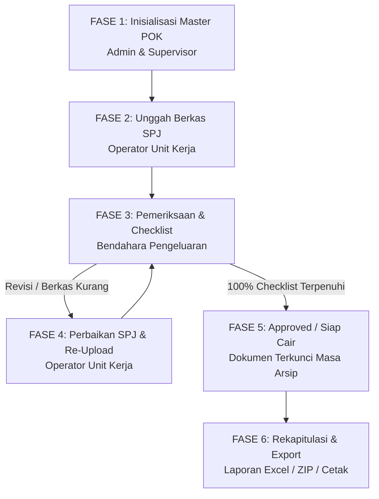

# 📘 DOKUMENTASI LENGKAP SISTEM DATA DIGITAL ARSIP KEUANGAN BPS KABUPATEN SUBANG

---

## 📌 1. LATAR BELAKANG & TUJUAN UTAMA SISTEM

### Latar Belakang Dibuatnya Sistem
Pada tata kelola keuangan negara di lingkungan **Badan Pusat Statistik (BPS) Kabupaten Subang**, setiap pencairan dana operasional maupun honor petugas kegiatan (seperti *Sensus Ekonomi*, *Survei Pertanian*, *Publisitas*, dll.) membutuhkan dokumen pertanggungjawaban fisik (**SPJ / Surat Pertanggungjawaban**) berupa Kuitansi, BAPP Honor, Kerangka Acuan Kerja (KAK), SK Petugas, dan Bukti Penerimaan.

Sebelum adanya sistem ini, pengelolaan SPJ menghadapi beberapa kendala utama:
1. **Risiko Berkas Tercecer / Hilang**: Pengelolaan arsip kertas rawan hilang saat pemeriksaan audit internal/eksternal.
2. **Proses Verifikasi Manual Lambat**: Bendahara Pengeluaran harus memeriksa lembar demi lembar berkas fisik secara manual tanpa indikator persentase kelengkapan yang jelas.
3. **Kurangnya Transparansi Serapan Anggaran**: Operator unit kerja kesulitan memantau item POK mana saja yang sudah disetujui (siap cair), mana yang sedang diproses, atau mana yang ditolak/butuh revisi.

### Tujuan Utama Sistem
Aplikasi **Sistem Data Digital Arsip Keuangan BPS Kabupaten Subang** dibangun untuk menyelesaikan masalah tersebut dengan menyediakan platform digitalisasi SPJ yang aman, transparan, terstruktur, dan akuntabel.

---

## 🏷️ 2. IDENTITAS & STANDAR DESAIN SISTEM

- **Nama Resmi Sistem**: `Sistem Data Digital Arsip Keuangan BPS Kabupaten Subang` *(Enforced di seluruh header, sidebar, login title, document title, dan config app)*.
- **Standar Desain**: **SAKDI Design System v2.1.0**
  - **Palet Warna Resmi BPS**:
    - 🔵 *BPS Primary Blue*: `#0057A8`
    - 🔷 *BPS Navy Header/Sidebar*: `#002D5C`
    - 🟠 *BPS Accent Orange*: `#E8601C`
    - 🟢 *BPS Positive Green*: `#00873E`
- **Tampilan Responsive & Full-Width**: Menggunakan container `w-full` seragam untuk semua role pengguna.

---

## 🏗️ 3. ARSITEKTUR & TECH STACK

- **Backend Framework**: Laravel 11.x (PHP 8.2+)
- **Frontend Framework**: Blade Templates, Tailwind CSS, Alpine.js (Zero-Flicker UX & Dynamic Interactivity)
- **Database Engine**: SQLite / MySQL (Terstruktur dengan migration & seeder)
- **Penyimpanan File Privat (Private Storage Security)**:
  - Seluruh berkas PDF / Gambar SPJ **TIDAK disimpan di folder publik (`public/`)**, melainkan di folder privat server (`storage/app/private/uploads/...`).
  - Berkas hanya bisa diakses via streaming controller (`/documents/{doc}/stream`) dengan verifikasi sesi autentikasi pengguna.

---

## 📊 4. HIRARKI MASTER DATA POK (8-LEVEL DIPA)

Aplikasi mengadopsi struktur resmi Petunjuk Operasional Kegiatan (POK) DIPA BPS:

```
📅 1. TAHUN ANGGARAN (DIPA 2026)
 └── 📁 2. PROGRAM (contoh: GG.2902 - Program Penyediaan & Pelayanan Informasi Statistik)
      └── 📁 3. OUTPUT (contoh: BMA - Dukungan Manajemen & Pelaksanaan Tugas)
           └── 📦 4. SUB-OUTPUT (contoh: BMA.006 - Layanan Sensus Ekonomi 2026)
                └── 🔶 5. KOMPONEN (contoh: 051 - Pelaksanaan Sensus SE2026)
                     └── 🔷 6. SUB-KOMPONEN (contoh: 051.0A - Tanpa Sub Komponen)
                          └── 💳 7. AKUN (contoh: 521213 - Belanja Honor Output Kegiatan)
                               └── 📋 8. ITEM KEGIATAN (contoh: 001366 - Honor Petugas Sensus)
```

---

## 🔐 5. HAK AKSES PENGGUNA (ROLE-BASED ACCESS CONTROL - RBAC)

Aplikasi memiliki 4 Role Pengguna dengan batas wewenang yang tegas:

| Role Pengguna | Tanggung Jawab & Hak Akses Utama |
| :--- | :--- |
| 🔵 **`ADMIN`** | Akses penuh ke seluruh fitur sistem (Manajemen User, Kelola Master POK, Verifikasi Bendahara, Unggah SPJ, & Export Laporan). |
| 🟣 **`SUPERVISOR`** | Pengawasan tingkat pimpinan: Mengelola Master Data POK DIPA, Monitoring Rekapitulasi Laporan, Unggah Berkas, & Export Laporan. |
| 🟢 **`OPERATOR`** | Pelaksana Unit Kerja: Mengunggah berkas SPJ pada Item POK, menghapus berkas milik sendiri, & membaca revisi Bendahara. |
| 🟠 **`BENDAHARA`** | Bendahara Pengeluaran: Mengakses Inbox Verifikasi, melakukan centang checklist berkas, & menetapkan keputusan *APPROVED* / *REJECTED*. |

---

## 🔄 6. ALUR KERJA OPERASIONAL LENGKAP (END-TO-END WORKFLOW)



---

## 🛡️ 7. RULES & GUARD LOGIC (ATURAN KEAMANAN SISTEM)

Sistem dilengkapi 7 Guard Keamanan Teruji yang berjalan di tingkat Backend Server:

1. 🛡️ **Guard 1 (Lock Item Approved)**: Operator diblokir dari mengunggah/menghapus dokumen pada item yang sudah berstatus `APPROVED`.
2. 🛡️ **Guard 2 (Aturan Persetujuan 100% Checklist)**: Bendahara **TIDAK BISA** menyetujui item jika ada dokumen yang belum dicentang (`is_checked = false`) atau jika belum ada dokumen yang diunggah.
3. 🛡️ **Guard 3 (Garbage Collection File Fisik)**: Jika data dokumen dihapus di database, file fisik pada folder *storage private* server otomatis terhapus bersih dari disk.
4. 🛡️ **Guard 4 (Proteksi Kepemilikan Dokumen)**: Operator hanya diperbolehkan menghapus dokumen yang diunggah oleh dirinya sendiri (Supervisor & Admin bisa menghapus semua).
5. 🛡️ **Guard 5 (Reset Checklist Otomatis)**: Ketika item ditolak (`REJECTED`) atau saat Operator mengunggah berkas baru pada item yang pernah ditolak, seluruh checklist di-reset ke `false` untuk verifikasi ulang dari awal.
6. 🛡️ **Guard 6 (Segregation of Duties / Prinsip Empat Mata)**: Pengguna (Admin) yang mengunggah dokumen pada suatu item **DIBLOKIR / DILARANG MENYETUJUI (`APPROVED`)** item pencairannya sendiri demi memenuhi standar audit keuangan negara.
7. 🛡️ **Guard 7 (Immutability Audit Log)**: Model `ActivityLog` bersifat Insert-Only (Append-Only). Log tidak dapat diubah (`updating`) atau dihapus (`deleting`) oleh siapapun via aplikasi.
8. ⏰ **Server Timezone Security (WIB / Asia/Jakarta)**: Seluruh timestamp transaksi diambil langsung dari jam server.

---

## 🧪 8. STATUS PENGUJIAN OTOMATIS (TEST SUITE)

Seluruh logika sistem diuji secara berkala dengan perintah:
```bash
php artisan test --filter BpsSystemTest
```
- **Hasil Test**: `✓ 13 Passed, 1 Skipped (ZipArchive CLI), 48 Assertions PASSING`.

---

## 👨‍💻 9. PANDUAN UNTUK AI AGENT / DEVELOPER SELANJUTNYA

1. **JANGAN MERUSAK NAMA RESMI SISTEM**: Selalu gunakan `Sistem Data Digital Arsip Keuangan BPS Kabupaten Subang`.
2. **JANGAN MENGHAPUS GUARD KEAMANAN**: Seluruh 7 Guard di `ItemController.php`, `DocumentController.php`, dan `ActivityLog.php` harus tetap dipertahankan.
3. **SAKDI DESIGN SYSTEM**: Selalu gunakan CSS Variables dari SAKDI v2.1.0 (`--color-primary`, `--color-neutral-900`, dll.) dan class utility `sakdi-card`, `sakdi-btn`, `sakdi-table`.
4. **JANGAN MENGGUNAKAN FOLDER PUBLIC UNTUK UPLOAD**: File upload wajib menggunakan disk `private` dan diakses via controller stream.

---
*Dokumen ini dibuat secara rinci agar dapat dibaca dan diverifikasi oleh tim pengembang maupun AI Agent pendamping.*
