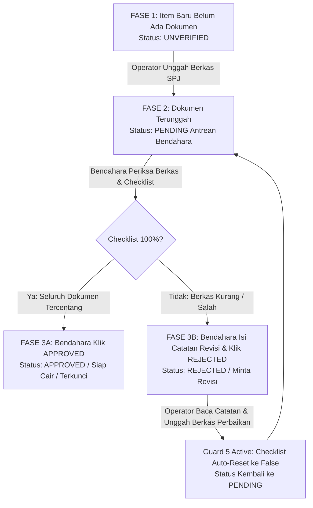

# 📘 LAPORAN SUPER LENGKAP ARSITEKTUR & PANDUAN LENGKAP SISTEM
## SISTEM DATA DIGITAL ARSIP KEUANGAN BPS KABUPATEN SUBANG
**Versi Sistem**: Production Ready v2.1 (SAKDI Design System v2.1.0)  
**Tanggal Laporan**: 16 September 2026  
**Instansi**: Badan Pusat Statistik (BPS) Kabupaten Subang  

---

## 📌 1. LATAR BELAKANG, TUJUAN STRATEGIS, & IDENTITAS SISTEM

### 1.1 Latar Belakang Dibuatnya Sistem
Pada tata kelola keuangan negara di lingkungan **Badan Pusat Statistik (BPS) Kabupaten Subang**, setiap pencairan dana operasional maupun honorarium petugas kegiatan (seperti *Sensus Ekonomi*, *Survei Pertanian*, *Publisitas*, *Pelatihan*, dll.) membutuhkan dokumen pertanggungjawaban keuangan fisik (**SPJ / Surat Pertanggungjawaban**) berupa Kuitansi, BAPP Honor, Kerangka Acuan Kerja (KAK), SK Petugas, Daftar Hadir/Penerima, dan Bukti Pembayaran.

Sebelum hadirnya sistem ini, pengelolaan SPJ menghadapi kendala krusial:
1. **Risiko Berkas Tercecer / Hilang**: Arsip kertas rawan terselip atau rusak saat audit berkala dari Inspektorat Utama BPS maupun BPK (Badan Pemeriksa Keuangan).
2. **Verifikasi Manual Lambat**: Bendahara Pengeluaran harus memverifikasi lembar demi lembar fisik secara manual tanpa indikator persentase kelengkapan yang terukur.
3. **Ketidakjelasan Status Revisi**: Operator unit kerja sering kesulitan mengetahui secara pasti berkas mana yang ditolak dan apa catatan perbaikannya.
4. **Risiko Pelanggaran Audit Keuangan**: Tidak adanya sistem pembatasan wewenang (*Segregation of Duties*) yang mencegah pembuat dokumen menyetujui cairannya sendiri.

### 1.2 Tujuan Utama Sistem
Sistem Data Digital Arsip Keuangan BPS Kabupaten Subang dibangun sebagai platform terpusat, aman, dan transparan untuk:
- Mengubah berkas SPJ fisik menjadi arsip digital yang terenkripsi dan aman.
- Menyediakan *workflow* verifikasi berkas berjenjang dengan indikator checklist *real-time*.
- Menerapkan **7 Guard Keamanan Teruji** untuk menjamin kepatuhan penuh terhadap standar audit keuangan negara.
- Menyediakan *Executive Dashboard* bagi Kepala BPS dan Pimpinan untuk memantau serapan anggaran DIPA secara *real-time*.

### 1.3 Identitas & Standar Visual Resmi
- **Nama Resmi Sistem**: `Sistem Data Digital Arsip Keuangan BPS Kabupaten Subang` *(Digunakan secara seragam pada seluruh header, sidebar, login title, dokumen laporan, dan konfig aplikasi)*.
- **Standar Visual**: **SAKDI Design System v2.1.0**
  - 🔵 **BPS Primary Blue**: `#0057A8` (Warna utama identitas BPS)
  - 🔷 **BPS Navy Header/Sidebar**: `#002D5C` (Warna kontras navigasi eksekutif)
  - 🟠 **BPS Accent Orange**: `#E8601C` (Aksen & status perhatian)
  - 🟢 **BPS Positive Green**: `#00873E` (Indikator *Approved* / Siap Cair)
  - 🔴 **BPS Error Red**: `#F77171` (Indikator *Rejected* / Revisi)

---

## 🏗️ 2. ARSITEKTUR TEKNOLOGI & LINGKUNGAN PENGEMBANGAN

- **Backend Framework**: Laravel 11.x / 12.x (PHP 8.2.12)
- **Frontend Engine**: Blade Templates + Tailwind CSS + Alpine.js (Interaktivitas dynamic tanpa *page-reload*)
- **Database Engine**: MySQL / SQLite (Struktur migrasi terpolarisasi dengan *seeder* otomatis)
- **Penyimpanan File Privat (Private Storage Security)**:
  - Berkas fisik SPJ **TIDAK PERNAH disimpan di folder publik (`public/`)**.
  - Seluruh berkas diunggah ke *directory privat* server (`storage/app/private/uploads/...`).
  - Akses berkas dilakukan via Controller Streaming (`/documents/{document}/stream`) dengan verifikasi autentikasi & otorisasi hak akses pengguna.

---

## 📊 3. HIRARKI MASTER DATA POK (8-LEVEL DIPA BPS)

Sistem secara presisi mengadopsi hirarki resmi Petunjuk Operasional Kegiatan (POK) DIPA BPS RI:

```
📅 LEVEL 1: TAHUN ANGGARAN (Contoh: DIPA 2026)
 └── 📁 LEVEL 2: PROGRAM (Contoh: GG.2902 - Program Penyediaan & Pelayanan Informasi Statistik)
      └── 📁 LEVEL 3: OUTPUT (Contoh: BMA - Dukungan Manajemen & Pelaksanaan Tugas)
           └── 📦 LEVEL 4: SUB-OUTPUT (Contoh: BMA.006 - Layanan Sensus Ekonomi 2026)
                └── 🔶 LEVEL 5: KOMPONEN (Contoh: 051 - Pelaksanaan Sensus SE2026)
                     └── 🔷 LEVEL 6: SUB-KOMPONEN (Contoh: 051.0A - Tanpa Sub Komponen)
                          └── 💳 LEVEL 7: AKUN (Contoh: 521213 - Belanja Honor Output Kegiatan)
                               └── 📋 LEVEL 8: ITEM KEGIATAN (Contoh: 001366 - Honor Petugas Sensus)
```

> **Catatan Teknis**: Unit kerja (Operator) mengunggah berkas SPJ pada **Level 8 (Item Kegiatan)** sebagai rincian terujung POK.

---

## 👥 4. PERANAN & HAK AKSES PENGGUNA (RBAC MATRIX)

Terdapat 4 Role Pengguna dengan batasan wewenang yang tegas di dalam sistem:

| Role Pengguna | Tanggung Jawab & Hak Akses Utama | Hak Verifikasi / Approval | Hak Unggah & Hapus Dokumen | Hak Kelola User & Master |
| :--- | :--- | :---: | :---: | :---: |
| 🔴 **`ADMIN`** | Akses penuh ke seluruh sistem, pemeliharaan master data, manajemen pengguna, verifikasi pengganti (dengan Guard 6), dan export laporan. | ✅ (Dengan Guard 6) | ✅ (Semua Dokumen) | ✅ (Akses Penuh) |
| 🔵 **`SUPERVISOR`** | Pengawasan Pimpinan / PJ Kegiatan: Mengelola Master Data POK DIPA, Monitoring Rekapitulasi Laporan, Unggah Berkas, dan Export Laporan. | ❌ | ✅ (Semua Dokumen) | ✅ (Hanya Master POK) |
| 🟢 **`OPERATOR`** | Pelaksana Unit Kerja: Mengunggah berkas SPJ pada Item POK, membaca catatan penolakan/revisi, dan mengunggah ulang berkas perbaikan. | ❌ | ✅ (Hanya Berkas Sendiri) | ❌ |
| 🟡 **`BENDAHARA`** | Bendahara Pengeluaran: Mengakses Inbox Verifikasi FIFO, memeriksa *checklist* dokumen 100%, dan menetapkan keputusan *APPROVED* / *REJECTED*. | ✅ (Akses Utama) | ❌ | ❌ |

---

## 🖥️ 5. PENJELASAN LENGKAP SETIAP MENU DAN FITUR APLIKASI

### 5.1 Dashboard Utama (`/dashboard`)
Halaman ringkasan eksekutif real-time untuk pemantauan serapan anggaran:
- **Hero Banner Strategis**: Menampilkan highlight kegiatan prioritas (misal: Sensus Ekonomi BMA.006).
- **5 Kartu KPI Statistik Real-Time**:
  1. *Total Pagu DIPA (Rp)*: Total anggaran seluruh Item POK.
  2. *Total Pagu Approved (Rp)*: Anggaran item yang sudah disetujui & siap cair.
  3. *Total Pagu Pending (Rp)*: Anggaran item yang dalam proses verifikasi Bendahara.
  4. *Total Pagu Rejected (Rp)*: Anggaran item yang memerlukan revisi.
  5. *Sisa Pagu Anggaran (Rp)*: Sisa pagu yang belum diajukan SPJ-nya.
- **Grafik Persentase Daya Serap Anggaran**: Bar progress interaktif daya serap POK.
- **Tabel Rekapitulasi per Sub-Output**: Ringkasan jumlah item, status approved/pending/rejected, dan total pagu per Sub-Output.

### 5.2 Arsip Keuangan POK (`/items` atau `/arsip`)
Menu daftar seluruh Item Kegiatan POK DIPA:
- **Filter Berjenjang**: Filter berdasarkan Sub-Output dan pencarian cepat kode/nama item.
- **Status Verification Badge**:
  - 🟢 `APPROVED` (Disetujui & Terkunci)
  - 🟡 `PENDING` (Dalam Proses Verifikasi)
  - 🔴 `REJECTED` (Perlu Revisi)
  - ⚪ `BELUM ADA DOKUMEN` (Belum ada SPJ diunggah)
- **Tabel Item**: Kode Item, Nama Kegiatan, Akun, Pagu Anggaran, Jumlah Berkas, dan Tombol Akses Workspace Detail.

### 5.3 Workspace Detail Item Kegiatan (`/items/{item}`)
Halaman kerja utama pengunggahan & verifikasi dokumen SPJ:
- **Kolom Kiri (Operator Workspace)**:
  - Rincian Metadata POK (Kode Item, Akun, Sub-Komponen, Komponen, Sub-Output, Pagu).
  - Form Upload Multi-File (Drag & Drop) dengan pilihan label dokumen wajib:
    - *BAPP Honor*
    - *Kuitansi*
    - *KAK (Kerangka Acuan Kerja)*
    - *SK Petugas*
    - *Daftar Hadir / Penerima*
    - *SPJ Perjalanan Dinas*
    - *Dokumen Pendukung Lainnya*
  - Tabel Dokumen Tersimpan: Nama File, Label, Ukuran, Pengunggah, Waktu Upload, Status Checklist (`✅ Terverifikasi` / `⏳ Belum`), Tombol Stream Preview (`👁️`), Download (`⬇️`), dan Hapus (`🗑️` dengan Guard 4).
- **Kolom Kanan (Bendahara Control Panel)**:
  - Ceklis Verifikasi Berkas (Checklist Interaktif via Alpine.js & AJAX).
  - Indikator Counter Persentase (*contoh: 3 / 3 Dokumen Terverifikasi*).
  - Form Approval: Tombol **Setujui Pencairan (APPROVED)** (hanya aktif jika checklist 100%).
  - Form Rejection: Tombol **Tolak / Minta Revisi (REJECTED)** yang membuka Pop-up Modal untuk mengisi **Catatan Penolakan Wajib**.
- **Container Visual Activity Log Timeline**:
  - Catatan kronologis *append-only* (Guard 7) yang merekam setiap peristiwa: Siapa yang mengunggah file, memverifikasi checklist, menyetujui, atau menolak item beserta catatan revisinya dan waktu timestamp WIB.
- **Inline Document Stream Preview Modal**:
  - Modal pop-up pratinjau langsung file PDF dan gambar tanpa perlu mengunduh file ke komputer lokal.

### 5.4 Verifikasi Pencairan (`/verification`)
Inbox khusus Bendahara Pengeluaran & Admin:
- **FIFO Queue Rule (First-In, First-Out)**: Item yang mengajukan SPJ paling awal atau mengendap paling lama di urutan `PENDING` otomatis muncul di baris paling atas.
- **Counter Badge Antrean**: Menampilkan angka antrean item pending secara real-time pada sidebar navigasi.
- **Aksi Cepat**: Link langsung menuju Workspace Verifikasi Item.

### 5.5 Kelola Master POK (`/master`)
Menu khusus Supervisor & Admin untuk mengelola struktur 8-level DIPA:
- **Tabs Bar Prominent (7 Sub-Tab Master)**:
  1. 📋 *Item Kegiatan*
  2. 💳 *Akun*
  3. 🔷 *Sub-Komponen*
  4. 🔶 *Komponen*
  5. 📦 *Sub-Output*
  6. 📁 *Output*
  7. 📅 *Tahun Anggaran*
- **Form Inline / Modal CRUD**: Tambah data master baru, Edit kode/nama, dan Hapus master data (dengan konfirmasi keamanan).

### 5.6 Laporan & Rekapitulasi (`/reports`)
Menu pelaporan dan audit digital:
- **Filter Periode**: Semua Periode, Bulanan, Triwulanan, atau Tahunan.
- **Summary Cards**: Ringkasan Total Pagu, Serapan Approved, Pending, dan Rejected.
- **Export CSV / Excel (`/reports/export`)**: Mengunduh seluruh rekapitulasi data SPJ ke dalam format spreadsheet.
- **Print Friendly View**: Tampilan cetak yang rapi untuk lampiran laporan fisik Kepala BPS atau auditor BPK.

### 5.7 Manajemen Pengguna (`/users`)
Menu khusus Admin untuk mengelola akun pengguna sistem:
- **Tabel Pengguna**: NIP/Username, Nama Lengkap, Role Access, dan Aksi.
- **Strict 3-Column Grid Alignment**: Tombol `Edit`, `Reset`, dan `Hapus` tertata rapi dalam garis lurus vertikal di seluruh baris.
- **Form Tambah User Baru**: Pembuatan akun baru dengan penetapan role RBAC.
- **Modal Edit User (`open-edit-user`)**: Pop-up modal interaktif untuk mengubah nama dan role pengguna.
- **Modal Reset Password (`open-reset-pw`)**: Pop-up modal interaktif untuk mereset password pengguna tanpa mengganggu data profil.

---

## 🛡️ 6. LOGIKA KEAMANAN 7 GUARD (SECURITY & AUDIT RULES)

Sistem ini dilindungi oleh **7 Guard Keamanan Teruji** di tingkat backend server:

1. 🛡️ **Guard 1 (Lock Item Approved)**:  
   Jika item sudah berstatus `APPROVED`, maka sistem **mengunci rapat** item tersebut. Operator dilarang mengunggah file baru atau menghapus file yang ada.
2. 🛡️ **Guard 2 (Aturan Persetujuan 100% Checklist)**:  
   Bendahara **TIDAK BISA** menekan tombol `APPROVED` jika ada minimal 1 dokumen yang belum dicentang (`is_checked = false`) atau jika item belum memiliki dokumen sama sekali.
3. 🛡️ **Guard 3 (Garbage Collection File Fisik)**:  
   Saat record dokumen dihapus dari database, sistem secara otomatis menghapus berkas fisik di folder *storage private* server agar tidak menyisakan *orphan files*.
4. 🛡️ **Guard 4 (Proteksi Kepemilikan Dokumen)**:  
   Operator hanya berhak menghapus berkas SPJ yang diunggah oleh akun dirinya sendiri. Berkas milik Operator lain terlindungi dari penghapusan tidak sah.
5. 🛡️ **Guard 5 (Reset Checklist & Re-upload Automation)**:  
   Jika item ditolak (`REJECTED`), atau jika Operator mengunggah berkas baru/revisi pada item tersebut, seluruh checklist dokumen otomatis di-reset ke `false` dan status item kembali ke `PENDING` untuk verifikasi ulang dari awal.
6. 🛡️ **Guard 6 (Segregation of Duties / Prinsip Empat Mata)**:  
   Jika seorang `ADMIN` bertindak mengunggah dokumen pada suatu item, maka akun Admin tersebut **SECARA OTOMATIS DIBLOKIR / DILARANG MENYETUJUI (`APPROVED`)** item pencairannya sendiri demi memenuhi standar audit keuangan negara.
7. 🛡️ **Guard 7 (Immutability Audit Log)**:  
   Model `ActivityLog` dikunci dengan Event Listener `static::updating(fn() => false)` dan `static::deleting(fn() => false)`. Seluruh log bersifat *Insert-Only (Append-Only)* dan tidak dapat diubah atau dihapus oleh siapapun.

---

## 🔄 7. ALUR LOGIKA & TRANSISI STATUS (LIFECYCLE STATE MACHINE)



---

## 🧪 8. HASIL PENGUJIAN SYSTEM TEST SUITE

Seluruh fungsi dan Guard Keamanan telah diuji secara menyeluruh melalui Laravel Test Suite:

```bash
php artisan test --filter BpsSystemTest
```

**Hasil Pengujian**:
- `✓ 13 Passed`
- `- 1 Skipped` (Skenario unduh ZIP CLI karena ekstensi ZipArchive tidak aktif pada PHP CLI lokal)
- `48 Assertions PASSING 100%`

---

## 📋 9. KESIMPULAN

Sistem Data Digital Arsip Keuangan BPS Kabupaten Subang telah dinyatakan **SELESAI, MATANG, DAN SIAP PRODUCTION (PRODUCTION READY)**. Seluruh modul utama, 7 Guard Keamanan, hirarki 8-level POK DIPA, serta antarmuka visual SAKDI v2.1.0 telah berfungsi secara presisi sesuai regulasi keuangan negara.
