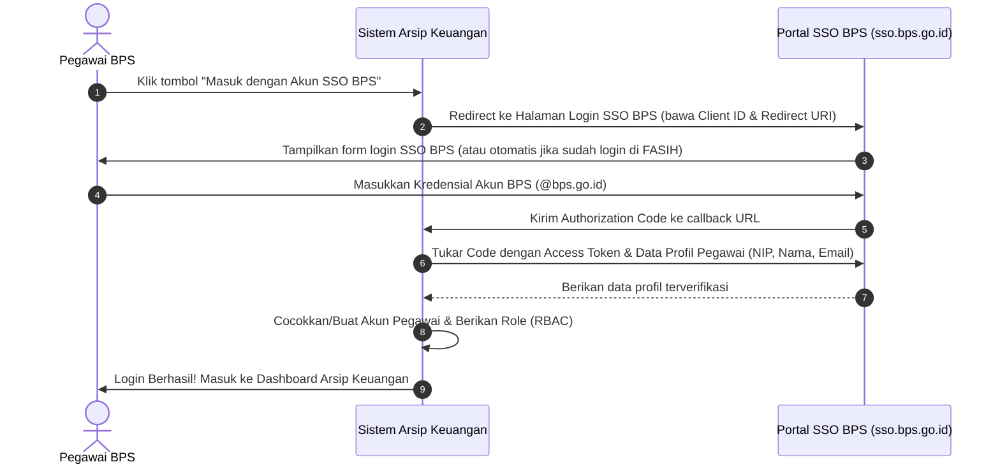

# 🔑 DOKUMEN RENCANA INTEGRASI SINGLE SIGN-ON (SSO) BPS
## SISTEM DATA DIGITAL ARSIP KEUANGAN BPS KABUPATEN SUBANG
### (Penyelarasan dengan Ekosistem Web BPS: FASIH, SIMPEG, & Portal BPS RI)

> **Status Dokumen:** Rencana Strategis & Cetak Biru Integrasi (Belum Dieksekusi / Disimpan untuk Implementasi Produksi).  
> **Tujuan:** Menyelaraskan sistem autentikasi aplikasi kearsipan keuangan dengan standar ekosistem digital BPS nasional (seperti pada web **FASIH BPS**) menggunakan **SSO BPS (Single Sign-On BPS RI)**.

---

## 📑 DAFTAR ISI
1. [Latar Belakang & Penyelarasan Ekosistem FASIH BPS](#1-latar-belakang--penyelarasan-ekosistem-fasih-bps)
2. [Alur Kerja Otentikasi SSO BPS (OAuth 2.0 / OpenID Connect)](#2-alur-kerja-otentikasi-sso-bps-oauth-20--openid-connect)
3. [Pemetaan Otomatis Peran Pengguna (Role Mapping RBAC)](#3-pemetaan-otomatis-peran-pengguna-role-mapping-rbac)
4. [Strategi Dual-Mode (SSO BPS + Fallback NIP Lokal)](#4-strategi-dual-mode-sso-bps--fallback-nip-lokal)
5. [Cetak Biru Teknis Implementasi (Laravel Socialite)](#5-cetak-biru-teknis-implementasi-laravel-socialite)
6. [Desain Antarmuka Login Terpadu](#6-desain-antarmuka-login-terpadu)
7. [Tahapan Pengajuan & Integrasi ke Pusdatin / IPDS BPS](#7-tahapan-pengajuan--integrasi-ke-pusdatin--ipds-bps)

---

## 1. LATAR BELAKANG & PENYELARASAN EKOSISTEM FASIH BPS

Aplikasi **FASIH (Fasilitas Pengumpulan Data Sensus dan Survei Terintegrasi BPS)** dan berbagai aplikasi internal BPS lainnya memanfaatkan **SSO BPS** (`sso.bps.go.id` / Keycloak BPS) sebagai pintu gerbang autentikasi tunggal.

### Manfaat Integrasi SSO BPS untuk Sistem Kearsipan Keuangan:
1. **Satu Akun untuk Semua Sistem:** Pegawai BPS Kabupaten Subang tidak perlu membuat atau mengingat kata sandi baru; cukup menggunakan akun email resmi `@bps.go.id` / NIP SSO yang biasa dipakai di FASIH.
2. **Sinkronisasi Data Otomatis:** Nama lengkap, NIP resmi, email instansi, dan unit kerja otomatis tersinkronisasi langsung dari database kepegawaian pusat BPS.
3. **Keamanan & Offboarding Terpusat:** Jika ada pegawai yang mutasi, pensiun, atau dinonaktifkan di BPS pusat, akses ke sistem arsip keuangan ini otomatis terputus seketika tanpa perlu admin menghapus manual satu per satu.

---

## 2. ALUR KERJA OTENTIKASI SSO BPS (OAUTH 2.0)



---

## 3. PEMETAAN OTOMATIS PERAN PENGGUNA (ROLE MAPPING RBAC)

Saat pegawai berhasil login via SSO BPS, sistem mencocokkan peran (*Role*) berdasarkan database lokal atau data atribut dari SSO BPS:

| Data Pegawai dari SSO BPS | Peran di Sistem Arsip | Hak Akses |
| :--- | :--- | :--- |
| **Bendahara Pengeluaran BPS Subang** | `BENDAHARA` | Inbox Verifikasi SPJ, Checklist Dokumen, Keputusan Approve/Reject. |
| **Kepala / Kasubbag Umum / PJ Kegiatan** | `SUPERVISOR` | Kelola Master POK DIPA, Monitoring Serapan Anggaran, Rollover POK. |
| **Staf Fungsi / Operator Kegiatan Sensus** | `OPERATOR` | Unggah Berkas SPJ (BAPP, Kuitansi), Perbaikan Revisi. |
| **Administrator IT / Pengelola Sistem Subang** | `ADMIN` | Akses penuh, manajemen user, konfigurasi sistem. |

> *Catatan:* Peran pertama kali dapat diberikan secara default sebagai `OPERATOR`, lalu Administrator/Supervisor dapat menaikkan peran menjadi `BENDAHARA` atau `SUPERVISOR` melalui menu Manajemen Pengguna.

---

## 4. STRATEGI DUAL-MODE (SSO BPS + FALLBACK NIP LOKAL)

Untuk menjaga kelancaran operasional (misalnya saat server SSO BPS pusat sedang pemeliharaan/RTO atau untuk mitra/petugas lapangan non-organik):

```
+-------------------------------------------------------------+
|                      🏛️ SISTEM ARSIP BPS                     |
|                                                             |
|           [ 🌐 Masuk Menggunakan Akun SSO BPS ]             |
|              (Satu pintu bersama FASIH & SIMPEG)            |
|                                                             |
|                         --- ATAU ---                        |
|                                                             |
|     NIP / Username: [ ___________________________ ]         |
|     Kata Sandi:     [ ___________________________ ]         |
|     [ 🔒 Masuk dengan Kredensial Lokal / Petugas ]          |
+-------------------------------------------------------------+
```

---

## 5. CETAK BIRU TEKNIS IMPLEMENTASI (LARAVEL SOCIALITE)

Jika nanti diaktifkan, modul ini dapat dibangun menggunakan package standar industri `laravel/socialite`:

### 5.1 Konfigurasi Environment (`.env`)
```env
# Konfigurasi SSO BPS (OAuth2)
BPS_SSO_ENABLED=true
BPS_SSO_CLIENT_ID=arsip_keuangan_subang_prod
BPS_SSO_CLIENT_SECRET=kunci_rahasia_dari_pusdatin_bps
BPS_SSO_REDIRECT_URI=https://arsipkeuangan-subang.bps.go.id/auth/sso/callback
BPS_SSO_BASE_URL=https://sso.bps.go.id
```

### 5.2 Controller Blueprint: `SsoBpsController.php`
```php
namespace App\Http\Controllers\Auth;

use App\Http\Controllers\Controller;
use App\Models\User;
use Illuminate\Support\Facades\Auth;
use Laravel\Socialite\Facades\Socialite;

class SsoBpsController extends Controller
{
    // Mengarahkan pengguna ke halaman login SSO BPS
    public function redirectToSso()
    {
        return Socialite::driver('bps')->redirect();
    }

    // Menerima data callback dari SSO BPS
    public function handleSsoCallback()
    {
        try {
            $bpsUser = Socialite::driver('bps')->user();
            
            // Ekstrak NIP, Nama, dan Email dari SSO
            $nip   = $bpsUser->getId(); // NIP Pegawai
            $name  = $bpsUser->getName();
            $email = $bpsUser->getEmail();

            // Cari user di database lokal atau buat jika baru
            $user = User::firstOrCreate(
                ['nip_username' => $nip],
                [
                    'name'     => $name,
                    'password' => bcrypt(str()->random(32)), // Random password untuk akun SSO
                    'role'     => 'OPERATOR', // Default role aman
                ]
            );

            // Update nama jika ada perubahan di data pusat
            $user->update(['name' => $name]);

            // Login-kan user ke sistem
            Auth::login($user, remember: true);

            return redirect()->intended(route('dashboard'))
                ->with('success', "Selamat datang, {$user->name}! Berhasil masuk via SSO BPS.");

        } catch (\Exception $e) {
            return redirect()->route('login')
                ->with('error', 'Gagal melakukan autentikasi dengan SSO BPS: ' . $e->getMessage());
        }
    }
}
```

---

## 6. TAHAPAN PENGAJUAN & INTEGRASI KE PUSDATIN / IPDS BPS

Untuk menghubungkan sistem ini ke server SSO BPS resmi:

1. **Pengajuan Client ID ke Pengelola SSO BPS (Pusdatin / BPS Provinsi):**
   * Mengajukan tiket permohonan aplikasi baru dengan nama `SISTEM DATA DIGITAL ARSIP KEUANGAN BPS KABUPATEN SUBANG`.
   * Mendaftarkan URL Callback Resmi (`https://domain-arsip.bps.go.id/auth/sso/callback`).
2. **Penerimaan Kredensial Resmi:**
   * Menerima `CLIENT_ID` dan `CLIENT_SECRET` resmi BPS.
3. **Pemasangan & Pengujian di Server Produksi:**
   * Memasukkan kredensial ke `.env` dan menguji alur login SSO satu klik.

---

> 📌 **Catatan:** Dokumen ini telah disimpan di dalam repositori sebagai cetak biru integrasi resmi. Kode aplikasi saat ini tetap menggunakan autentikasi NIP lokal yang stabil dan siap dihubungkan ke SSO BPS kapan saja saat permohonan `CLIENT_ID` ke Pusdatin telah disetujui.
