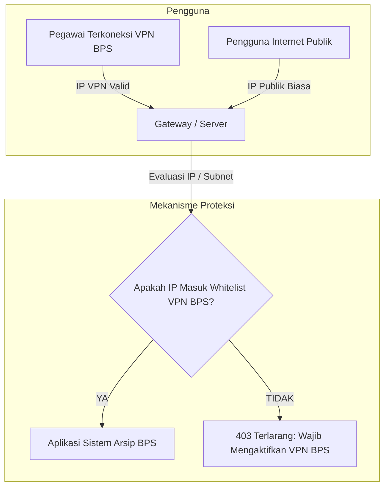

# 🔒 DOKUMEN RENCANA ARSITEKTUR & KONFIGURASI AKSES KHUSUS VPN BPS
## SISTEM DATA DIGITAL ARSIP KEUANGAN BPS KABUPATEN SUBANG

> **Status Dokumen:** Rencana Strategis & Panduan Teknis (Belum Dieksekusi / Siap Diterapkan Saat Produksi).  
> **Tujuan:** Memberikan panduan arsitektur keamanan tingkat lanjut agar seluruh akses ke sistem kearsipan keuangan hanya dapat dibuka apabila pengguna terhubung ke jaringan resmi **VPN BPS (Intranet BPS Kabupaten Subang / BPS RI)**.

---

## 📑 DAFTAR ISI
1. [Latar Belakang & Sasaran Keamanan](#1-latar-belakang--sasaran-keamanan)
2. [Pilihan Arsitektur Pembatasan Akses VPN (4 Pendekatan)](#2-pilihan-arsitektur-pembatasan-akses-vpn-4-pendekatan)
3. [Rencana Implementasi Level Aplikasi (Laravel Middleware)](#3-rencana-implementasi-level-aplikasi-laravel-middleware)
4. [Rencana Implementasi Level Infrastruktur & Web Server (Nginx / Cloud Firewall)](#4-rencana-implementasi-level-infrastruktur--web-server-nginx--cloud-firewall)
5. [Desain Tampilan Layar Penolakan (403 Akses Non-VPN)](#5-desain-tampilan-layar-penolakan-403-akses-non-vpn)
6. [Tahapan Pengujian & Rollout Produksi](#6-tahapan-pengujian--rollout-produksi)
7. [Matriks Perbandingan Strategi](#7-matriks-perbandingan-strategi)

---

## 1. LATAR BELAKANG & SASARAN KEAMANAN

Sebagai sistem yang mengelola berkas pertanggungjawaban keuangan negara (DIPA, BAPP, Kuitansi, SPJ), pembatasan akses hanya melalui **VPN Internal BPS** bertujuan:
1. **Zero Public Exposure:** Mencegah publik/pihak luar mengakses halaman login dan API kearsipan dari internet umum.
2. **Kepatuhan Regulasi Keamanan Informasi:** Memenuhi standar perlindungan data SPBE (Sistem Pemerintahan Berbasis Elektronik) dan protokol keamanan BPS.
3. **Pemberian Hak Khusus Pegawai:** Hanya aparatur dan petugas BPS yang memegang akun VPN resmi BPS yang dapat membuka dan mengoperasikan sistem.

---

## 2. PILIHAN ARSITEKTUR PEMBATASAN AKSES VPN (4 PENDEKATAN)



### Opsi 1: Network/Firewall Level (Rekomendasi Produksi Utama)
* **Mekanisme:** Konfigurasi IP Whitelist langsung pada Firewall Server / Cloud Provider / Nginx Reverse Proxy.
* **Kelebihan:** Sangat aman dan efisien karena traffic dari luar VPN langsung diputus di gerbang terluar sebelum membebani server PHP/Laravel.

### Opsi 2: Application Level (Laravel Middleware + Environment Config)
* **Mekanisme:** Menggunakan Middleware khusus `EnsureBpsVpnAccess` yang memeriksa IP klien dan range subnet CIDR yang terdaftar di berkas konfigurasi `.env`.
* **Kelebihan:** Sangat fleksibel, dapat menampilkan pesan panduan BPS resmi berbahasa Indonesia yang ramah ketika akses ditolak, serta mudah diatur mode *bypass*-nya saat masa pengembangan.

### Opsi 3: Zero Trust Access Gateway (Cloudflare Zero Trust / ZTNA)
* **Mekanisme:** Menempatkan aplikasi di balik Cloudflare Zero Trust dengan otentikasi email BPS (`@bps.go.id`) dan verifikasi perangkat VPN BPS.
* **Kelebihan:** Modern, tidak memerlukan konfigurasi IP statis yang rumit, dan dapat terintegrasi dengan Single Sign-On (SSO).

### Opsi 4: On-Premises Hosting di Server Kantor BPS Subang
* **Mekanisme:** Aplikasi di-hosting di server lokal LAN BPS Kabupaten Subang tanpa IP Publik langsung. Akses luar kantor dilakukan lewat OpenVPN Server BPS Subang.
* **Kelebihan:** Data fisik tetap berada 100% di ruang server internal kantor BPS Subang.

---

## 3. RENCANA IMPLEMENTASI LEVEL APLIKASI (LARAVEL MIDDLEWARE)

Jika nanti diaktifkan di level aplikasi, berikut arsitektur kode yang direncanakan:

### 3.1 Konfigurasi Environment (`.env`)
```env
# Konfigurasi Akses Jaringan VPN BPS
BPS_VPN_ENFORCE=true
BPS_VPN_ALLOWED_IPS=10.0.0.0/8,172.16.0.0/12,192.168.0.0/16,103.xxx.xxx.xxx/32
BPS_VPN_BYPASS_DEV=false
```

### 3.2 Blueprint Middleware: `EnsureBpsVpnAccess.php`
```php
namespace App\Http\Middleware;

use Closure;
use Illuminate\Http\Request;
use Symfony\Component\HttpFoundation\Response;
use Symfony\Component\HttpFoundation\IpUtils;

class EnsureBpsVpnAccess
{
    public function handle(Request $request, Closure $next): Response
    {
        // Jika pembatasan VPN dinonaktifkan di .env, loloskan request
        if (!config('bps.vpn.enforce', false)) {
            return $next($request);
        }

        // Bypass untuk environment local jika diizinkan
        if (app()->environment('local') && config('bps.vpn.bypass_dev', true)) {
            return $next($request);
        }

        $clientIp = $request->ip();
        $allowedIps = config('bps.vpn.allowed_ips', []);

        // Cek apakah IP pengguna sesuai dengan daftar IP/Subnet VPN BPS
        if (!IpUtils::checkIp($clientIp, $allowedIps)) {
            if ($request->expectsJson()) {
                return response()->json([
                    'status'  => 'FORBIDDEN',
                    'message' => 'Akses ditolak: Anda wajib terhubung ke jaringan resmi VPN BPS Kabupaten Subang.',
                    'client_ip' => $clientIp,
                ], 403);
            }

            return response()->view('errors.vpn-required', [
                'clientIp' => $clientIp,
            ], 403);
        }

        return $next($request);
    }
}
```

### 3.3 Penanganan Header Reverse Proxy (`TrustProxies`)
Memastikan `$request->ip()` membaca IP asli VPN klien saat aplikasi berada di balik Load Balancer/Proxy (seperti Render, Cloudflare, atau Nginx).

---

## 4. RENCANA IMPLEMENTASI LEVEL INFRASTRUKTUR & WEB SERVER

### 4.1 Konfigurasi Nginx Reverse Proxy
```nginx
# Blok Akses Hanya untuk Subnet VPN BPS
location / {
    # Subnet VPN BPS Subang / BPS RI
    allow 10.0.0.0/8;
    allow 172.16.0.0/12;
    allow 192.168.1.0/24;
    allow 103.140.xxx.xxx; # IP Publik Gateway BPS

    # Blokir seluruh akses internet lainnya
    deny all;

    proxy_pass http://127.0.0.1:8000;
    proxy_set_header Host $host;
    proxy_set_header X-Real-IP $remote_addr;
    proxy_set_header X-Forwarded-For $proxy_add_x_forwarded_for;
}
```

---

## 5. DESAIN TAMPILAN LAYAR PENOLAKAN (403 AKSES NON-VPN)

Ketika pengguna membuka web tanpa VPN BPS, sistem akan menampilkan halaman edukatif dan informatif:

```
+-------------------------------------------------------------------------+
|                              🏛️ BPS SUBANG                               |
|                                                                         |
|                ⚠️ AKSES TERBATAS — JARINGAN VPN DIPERLUKAN               |
|                                                                         |
|  Sistem Data Digital Arsip Keuangan BPS Kabupaten Subang hanya dapat   |
|  diakses melalui jaringan resmi VPN / Intranet BPS.                    |
|                                                                         |
|  Alamat IP Anda saat ini: 36.85.xxx.xxx (Internet Publik)               |
|  Status Jaringan: ❌ Belum Terhubung ke VPN BPS                        |
|                                                                         |
|  Petunjuk untuk Pegawai / Operator:                                    |
|  1. Buka aplikasi VPN resmi BPS (Cisco AnyConnect / FortiClient / dll). |
|  2. Lakukan login menggunakan akun SSO BPS Anda.                        |
|  3. Setelah terhubung, muat ulang (refresh) halaman ini.                |
|                                                                         |
|  [ 🔄 Muat Ulang Halaman ]          [ 📞 Hubungi Tim IT BPS Subang ]    |
+-------------------------------------------------------------------------+
```

---

## 6. TAHAPAN PENGUJIAN & ROLLOUT PRODUKSI

Apabila fitur ini hendak dieksekusi di masa mendatang, urutan langkahnya adalah:

1. **Tahap 1: Pengumpulan Data Subnet IP VPN BPS**
   * Berkoordinasi dengan Tim IPDS / Pengelola Jaringan BPS Kabupaten Subang & BPS Provinsi/RI untuk mencatat daftar Range IP (CIDR) yang dialokasikan untuk VPN BPS.
2. **Tahap 2: Pembuatan Middleware & Template Error 403**
   * Menambahkan `EnsureBpsVpnAccess.php` dan view `resources/views/errors/vpn-required.blade.php`.
3. **Tahap 3: Uji Coba Dual Mode (Staging)**
   * Menguji akses menggunakan VPN BPS aktif (harus lolos 200 OK) dan tanpa VPN (harus tampil 403 VPN Required).
4. **Tahap 4: Aktivasi Penuh di Lingkungan Produksi**
   * Mengubah `BPS_VPN_ENFORCE=true` di server produksi.

---

## 7. MATRIKS PERBANDINGAN STRATEGI

| Kriteria | Opsi 1: Firewall / Nginx | Opsi 2: Laravel Middleware | Opsi 3: Zero Trust Gateway | Opsi 4: Local Server BPS |
| :--- | :--- | :--- | :--- | :--- |
| **Tingkat Keamanan** | ⭐⭐⭐⭐⭐ Sangat Tinggi | ⭐⭐⭐⭐ Tinggi | ⭐⭐⭐⭐⭐ Sangat Tinggi | ⭐⭐⭐⭐⭐ Sangat Tinggi |
| **Kemudahan Maintenance** | ⭐⭐⭐ Sedang (via Server) | ⭐⭐⭐⭐⭐ Sangat Mudah (via .env) | ⭐⭐⭐⭐ Mudah (Cloud UI) | ⭐⭐⭐ Membutuhkan tim lokal |
| **Kenyamanan UX Pengguna** | Tampilan default Nginx 403 | Layar custom resmi BPS | Portal login SSO BPS | Mengandalkan LAN/OpenVPN |
| **Biaya Infrastruktur** | Gratis (fitur bawaan) | Gratis (fitur aplikasi) | Gratis/Sesuai kuota | Biaya server fisik |

---

> 📌 **Catatan:** Dokumen ini telah disimpan di dalam repositori sebagai referensi baku tim pengembang. Tidak ada kode aplikasi yang diubah saat ini sesuai arahan. Fitur ini siap diimplementasikan kapan saja ketika BPS Kabupaten Subang siap menerapkan penguncian VPN secara resmi.
